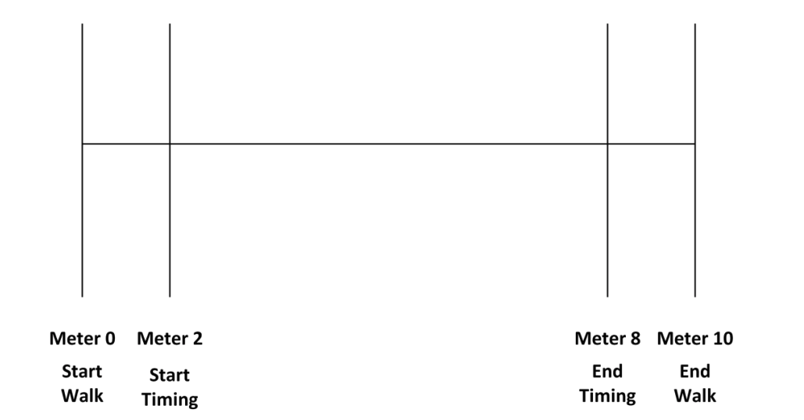
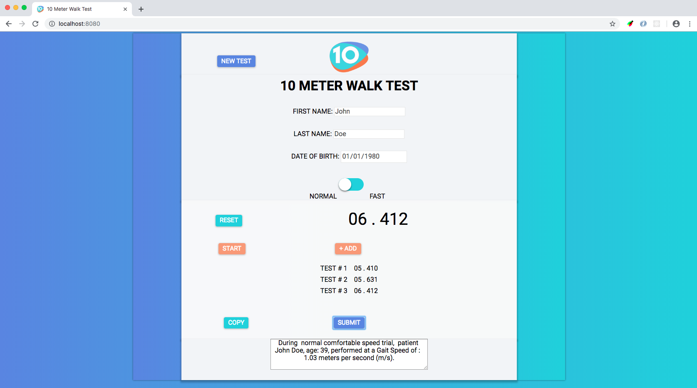

10 Meter Walk Test
===========================================================================

**Live Demo**: https://justinhacks.com

## A tool for measuring the progress of patients with partial mobility impairment.
#### Setting Up:

  
  Measure and mark a 10-meter walkway

  Add a marker at 2-meter
  
  Add a marker at 8-meter

#### Administer instructions:
  The individual walks without assistance for 10 meters, with the time measured for the intermediate 6 meters to allow for acceleration and deceleration. 
  Assistive devices may be used, but must be kept consistent and documented for each test. 
  Start timing when the toes pass the 2 meter mark.
  Stop timing when the toes pass the 8 meter mark.
  Can be tested at either preferred walking speed **(NORMAL)** or maximum walking speed **(FAST)**.
  (ensure to select the right choice in the app, which was tested)                  
  After performing three trials, the app will calculate the average of three trials and auto generate a patient result snippet that you can cut and paste into their **EMR**, Electronic Medical Record.

### Patient Instructions:

##### Normal comfortable speed trial:
 “I will say ready, set, go. When I say go, walk at your comfortable speed until I say  stop”
      (perform 3x and generate result)
##### Maximum speed trials:
 “I will say ready, set, go. When I say go, walk as fast as you safely can until I say stop”
     (perform 3x and generate result)

Getting Started
---------------

The easiest way to get started is to clone the repository:

        $ git clone https://github.com/tellisense/ten_meter_walk_test.git
      
        $ cd ten_meter_walk_test

Make it your own

        $ rm -rf .git && git init 

Install dependencies

        $ npm install

Start live-reload server

        $ npm start

Go to localhost url:

        http://localhost:8080

<h4 align="center">App Preview</h4>

Disclaimer
--------

- This app is **NOT** intended for clinical use 
- For **demonstration purposes only**  (please see **license** below) 

Features
--------

- Averaging test results **3 times** 
- calculating **age** based on birthday
- Auto generating patient transcript for cut and paste in **EMR**
- **API** for sending JSON data to Node.JS backend 

Prerequisites
-------------

- [Node.js 8.0+ NPM](https://www.npmjs.com/get-npm)
- Command Line Tools
 - &nbsp;**Mac OS X:** [VScode Mac](https://code.visualstudio.com/docs/?dv=osx)
 - &nbsp;**Windows:** [Visual Studio](https://www.visualstudio.com/products/visual-studio-community-vs) OR [Visaul Studio Code](https://code.visualstudio.com) + [Windows Subsystem for Linux - Ubuntu](https://docs.microsoft.com/en-us/windows/wsl/install-win10)
 - &nbsp;**Ubuntu** / &nbsp;**Linux Mint:** `sudo apt-get install build-essential`

**Note:** If you are new to Node or Express, I recommend to watch
[Node.js and Express 101](https://www.youtube.com/watch?v=BN0JlMZCtNU)
screencast by Alex Ford that teaches Node and Express from scratch. Alternatively,
here is another great tutorial for complete beginners - [Getting Started With Node.js, Express](http://cwbuecheler.com/web/tutorials/2013/node-express-mongo/).

Contribution
------------

If something is unclear, confusing, or needs to be refactored, please let me know.
Pull requests are always welcome
#### This project uses:
[Airbnb JavaScript Style Guide](https://github.com/airbnb/javascript) with a few minor exceptions. If you are submitting a pull request that involves Pug templates, please make sure you are using *spaces*, not tabs.

License
-------

The MIT License (MIT)

Copyright (c) 2019 Justin @tellisense

Permission is hereby granted, free of charge, to any person obtaining a copy of this software and associated documentation files (the "Software"), to deal in the Software without restriction, including without limitation the rights to use, copy, modify, merge, publish, distribute, sublicense, and/or sell copies of the Software, and to permit persons to whom the Software is furnished to do so, subject to the following conditions:

The above copyright notice and this permission notice shall be included in all copies or substantial portions of the Software.

THE SOFTWARE IS PROVIDED "AS IS", WITHOUT WARRANTY OF ANY KIND, EXPRESS OR IMPLIED, INCLUDING BUT NOT LIMITED TO THE WARRANTIES OF MERCHANTABILITY, FITNESS FOR A PARTICULAR PURPOSE AND NONINFRINGEMENT. IN NO EVENT SHALL THE AUTHORS OR COPYRIGHT HOLDERS BE LIABLE FOR ANY CLAIM, DAMAGES OR OTHER LIABILITY, WHETHER IN AN ACTION OF CONTRACT, TORT OR OTHERWISE, ARISING FROM, OUT OF OR IN CONNECTION WITH THE SOFTWARE OR THE USE OR OTHER DEALINGS IN THE SOFTWARE.
